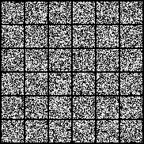

# MNIST Diffusion


Only simple depthwise convolutions, shorcuts and naive timestep embedding, there you have it! A fully functional denosing diffusion probabilistic model while keeps ultra light weight **4.55MB** (the checkpoint has 9.1MB but with ema model double the size).

## Training
Install packages
```bash
pip install -r requirements.txt
```
Start default setting training 
```bash
python train_mnist.py
```
Feel free to tuning training parameters, type `python train_mnist.py -h` to get help message of arguments.

## Reference
A neat blog explains how diffusion model works(must read!): https://lilianweng.github.io/posts/2021-07-11-diffusion-models/

The Denoising Diffusion Probabilistic Models paper: https://arxiv.org/pdf/2006.11239.pdf 

A pytorch version of DDPM: https://github.com/lucidrains/denoising-diffusion-pytorch

